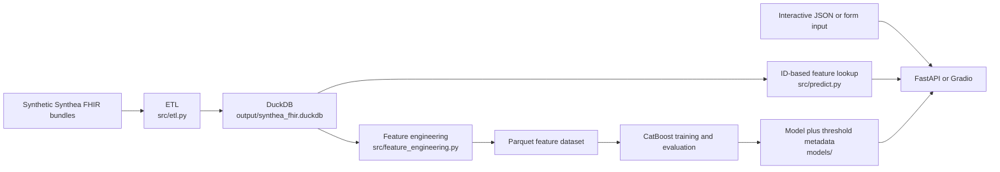

# Texas Hospital Readmission Prediction

[](https://github.com/ca34525/TexasReadmissionRiskAPI/actions/workflows/ci-cd.yml)

An end-to-end Python demonstration of 30-day hospital readmission prediction using synthetic Synthea FHIR data. The repository covers FHIR ETL, DuckDB feature engineering, CatBoost training and evaluation, a FastAPI service, a Gradio interface, Docker, and automated checks.

> [!IMPORTANT]
> This project uses synthetic patient data and is intended for portfolio, educational, and engineering-demonstration purposes only. It has not been clinically validated and must not be used for patient care, diagnosis, triage, or other clinical decisions.

## What the repository demonstrates

- A batch pipeline that converts raw FHIR bundles into a DuckDB database and a model-ready Parquet dataset.
- A matched CatBoost model and threshold metadata pair for repeatable serving.
- Two serving paths: a JSON API in `main.py` and an interactive Gradio UI in `app.py`.
- ID-based inference from a generated DuckDB database and payload-based inference without a database lookup.
- Automated unit, ETL integration, container, and smoke-test infrastructure.
- Narrative notebooks documenting the exploratory work that preceded the production modules in `src/`.

Core stack: Python 3.10, DuckDB, pandas, CatBoost, FastAPI, Gradio, Docker, pytest, and GitHub Actions.

## Architecture



The target, `readmitted_within_30_days`, is derived from the next inpatient admission after discharge. Future admission data is used to construct the target, not as a serving-time predictor.

## Quick start without Docker

Run commands from the repository root. Python 3.10 is the supported version.

```bash
python -m venv .venv

# macOS or Linux
source .venv/bin/activate

# Windows PowerShell (use this instead of the line above)
.venv\Scripts\Activate.ps1

python -m pip install --upgrade pip
python -m pip install -r requirements-dev.txt
```

`requirements.txt` contains application and pipeline dependencies.
`requirements-dev.txt` adds the test and lint tools. To work through the
exploratory notebooks, install `requirements-notebooks.txt` instead.

### Gradio UI

The committed model artifacts are enough to use the interactive form:

```bash
python app.py
```

Open [http://127.0.0.1:7860](http://127.0.0.1:7860). The historical-ID tab additionally requires `output/synthea_fhir.duckdb`, which is created by the pipeline; its encounter choices are populated from that database at startup.

### FastAPI service

Start the API explicitly with Uvicorn:

```bash
python -m uvicorn main:app --reload --host 127.0.0.1 --port 8000
```

Interactive API documentation is available at [http://127.0.0.1:8000/docs](http://127.0.0.1:8000/docs).

`GET /health/live` confirms that the API process is running. `GET /health/ready` verifies both the model artifacts and the ID-based prediction database; it returns `503` when the database has not yet been generated, even though payload-based predictions can still use an available model.

Example interactive prediction request:

```bash
curl --request POST "http://127.0.0.1:8000/predict/interactive" \
  --header "Content-Type: application/json" \
  --data '{
    "length_of_stay": 7,
    "age_at_admission": 50,
    "gender": "male",
    "race": "White",
    "marital_status": "M",
    "admission_reason": "Encounter for problem (procedure)",
    "payer": "Medicare",
    "total_claim_cost": 26483,
    "income": 74739,
    "admission_day_of_week": "Tuesday",
    "primary_diagnosis_code": "424132000",
    "provider_id": "us-npi|9999868992",
    "prior_admissions_last_year": 2,
    "num_diagnoses": 1,
    "num_procedures": 9,
    "num_medications": 1
  }'
```

The response has this shape; the probability and prediction below are illustrative:

```json
{
  "readmission_probability": 0.42,
  "prediction": 0,
  "threshold": 0.7
}
```

`GET /predict/{encounter_id}` uses the same response fields and adds `encounter_id`, but it requires the generated DuckDB database.

## Run the data pipeline

The canonical entry point is:

```bash
python -m src.pipeline
```

The command runs ETL, feature engineering, model training, and evaluation in sequence. It writes generated data under `output/` and replaces the matched artifacts in `models/`, so review model changes before committing them.

### Use the tracked synthetic fixture set

Set `FHIR_PATH` to `sample_data/` before running the pipeline.
Set `ETL_WORKERS` to a positive integer if you need to limit parallel parsing.

```bash
# macOS or Linux
FHIR_PATH=sample_data python -m src.pipeline
```

```powershell
# Windows PowerShell
$env:FHIR_PATH = "sample_data"
python -m src.pipeline
Remove-Item Env:FHIR_PATH
```

### Generate a larger synthetic dataset

The original reference dataset was generated with [Synthea](https://github.com/synthetichealth/synthea) using a fixed seed:

```bash
java -jar synthea-with-dependencies.jar Texas -p 100000 -s 42 --exporter.fhir.use_us_core_ig true --exporter.csv.export true --exporter.fhir.export true
```

Place the generated FHIR directory at `data/fhir/`, then run `python -m src.pipeline`. The `data/` and `output/` directories are intentionally excluded from version control.

### Data and artifact policy

| Path | Purpose | Version-control policy |
| --- | --- | --- |
| `sample_data/` | Bounded, synthetic FHIR fixture set used for portable integration work | Tracked |
| `data/` | Locally generated raw Synthea exports | Ignored |
| `output/` | Generated DuckDB, Parquet, test-set, and evaluation outputs | Ignored |
| `models/catboost_model.cbm` | Model loaded by both serving paths | Tracked intentionally |
| `models/model_metadata.json` | Decision threshold paired with the model | Tracked intentionally |

Treat the two files in `models/` as a matched pair. The committed metadata currently sets the decision threshold to `0.7`; that value is part of this demonstration and is not a clinically validated operating point.

## Docker

The current `Dockerfile` defaults to the Gradio UI on port `7860`. FastAPI is available from the same image by overriding the container command. A clean checkout can be built directly; the image creates empty artifact directories when generated output is not present.

```bash
docker build -t texas-readmission-demo .
```

Start the default Gradio UI:

```bash
docker run --rm -p 7860:7860 texas-readmission-demo
```

Start FastAPI instead:

```bash
docker run --rm -p 8000:8000 texas-readmission-demo python -m uvicorn main:app --host 0.0.0.0 --port 8000
```

To generate artifacts from the tracked fixture set inside the container, use bind mounts so the results persist on the host. This command also replaces the host model pair:

```bash
docker run --rm -e FHIR_PATH=/app/data -v "${PWD}/sample_data:/app/data:ro" -v "${PWD}/output:/app/output" -v "${PWD}/models:/app/models" texas-readmission-demo python -m src.pipeline
```

When serving newly generated artifacts, mount `output/` and the model pair rather than using the copies baked into the image. For example:

```bash
docker run --rm -p 7860:7860 -v "${PWD}/output:/app/output:ro" -v "${PWD}/models:/app/models:ro" texas-readmission-demo
```

## Tests

Run the default credential-free unit suite without external services or
generated artifacts:

```bash
python -m pytest
python -m ruff check .
python -m ruff format --check .
```

After generating a database from `sample_data/`, run the portable ETL integrity checks:

```bash
python -m pytest -m "not full_dataset" tests/test_etl.py
```

The exact-count reference checks are intentionally opt-in. Run them only when the complete reference dataset is available:

```bash
python -m pytest -m full_dataset tests/test_etl.py
```

The GitHub Actions workflow is defined in `.github/workflows/ci-cd.yml`; its current status is shown by the badge at the top of this page.

## Project structure

```text
TexasReadmissionRiskAPI/
├── .github/workflows/
│   ├── ci-cd.yml              # Credential-free pull-request and main CI
│   └── publish-image.yml      # Optional, manually dispatched image publish
├── models/
│   ├── catboost_model.cbm
│   └── model_metadata.json
├── notebooks/                 # Exploratory and narrative analysis
├── sample_data/               # Tracked synthetic FHIR fixtures
├── src/
│   ├── config.py              # Paths, feature lists, and threshold
│   ├── etl.py                 # FHIR-to-DuckDB ETL
│   ├── evaluate.py            # Hold-out evaluation artifacts
│   ├── feature_engineering.py # Target and feature construction
│   ├── inference.py           # Shared serving-time feature preparation
│   ├── model_artifacts.py     # Shared model and metadata loading
│   ├── pipeline.py            # Canonical orchestration entry point
│   ├── predict.py             # ID-based feature lookup and prediction
│   ├── train.py               # CatBoost training and artifact output
│   └── utils.py               # FHIR parsing helpers
├── tests/
├── app.py                     # Gradio entry point (port 7860)
├── main.py                    # FastAPI application (port 8000 via Uvicorn)
├── Dockerfile
├── pyproject.toml             # Focused Ruff configuration
├── pytest.ini
├── requirements-dev.txt
├── requirements-notebooks.txt
├── requirements.txt
└── README.md
```

`data/` and `output/` appear after local data generation and are not committed.

## Optional AWS deployment history

An earlier version of the demo was hosted on AWS App Runner, with a container image in Amazon ECR, IAM-based access, and generated artifacts staged in Amazon S3. That deployment is paused, and this repository does not advertise a live public endpoint.

Normal pull-request and `main` CI is credential-free. The separate `publish-image.yml` workflow is manual and retains the optional artifact-download and GHCR publishing path; it requires configured repository secrets. It does not deploy or modify AWS infrastructure. AWS is not required for local development or evaluation of the project.

## Limitations

- All data is synthetic; results do not establish performance on real patients or health systems.
- The repository is a demonstration architecture, not regulated or validated clinical decision-support software.
- Reproducing the original large-data experiment requires substantial compute and storage; `sample_data/` is intended for portable pipeline checks, not model-quality evaluation.
